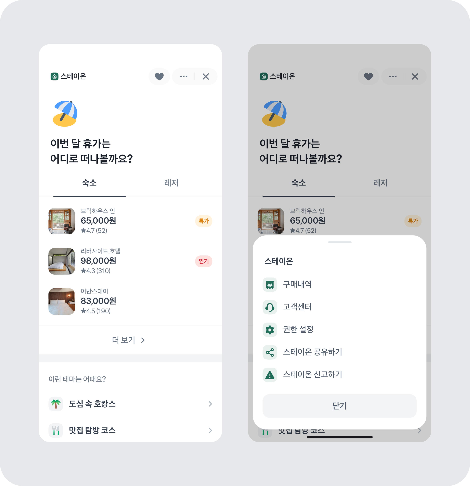

# 공통 네비게이션바

상단 공통 네비게이션바에 아이콘 추가하는 방법을 안내드려요.



- **React Native**: `useTopNavigation()`의 `addAccessoryButton()`으로 런타임에 버튼을 추가하거나, `granite.config.ts`의
  `navigationBar.initialAccessoryButton`으로 초기에 한 개를 노출할 수 있어요.

:::tip 홈 버튼 추가
홈으로 가는 진입점이 필요하다면 `withHomeButton: true` 를 사용해, 서비스 이름 왼쪽에 홈 버튼을 표시해주세요.\
네비게이션바 오른쪽(액세서리 버튼 영역)에는 홈 버튼을 따로 추가하지 마세요.
:::

## 시그니처

```typescript
interface NavigationBarOptions {
  withBackButton?: boolean; // 뒤로가기 버튼 유무
  withHomeButton?: boolean; // 홈버튼 유무
  initialAccessoryButton?: InitialAccessoryButton; // 1개만 노출 가능
}

interface InitialAccessoryButton {
  id: string;
  title?: string;
  icon: {
    name: string;
  };
}
```

## 예제

### 네비게이션 바에 아이콘 버튼 추가하기 (초기 설정)

```tsx [ReactNative]
import { appsInToss } from '@apps-in-toss/framework/plugins';
import { defineConfig } from '@granite-js/react-native/config';

export default defineConfig({
  // ...
  navigationBar: {
    withBackButton: true,
    withHomeButton: true,
    initialAccessoryButton: {
      icon: {
        name: 'icon-heart-mono',
      },
      id: 'heart',
      title: '하트',
    },
  },
})
,
],
})
;
```

### 네비게이션 바에 아이콘 추가하기 (동적 추가)

```tsx [ReactNative]
import { useTopNavigation } from '@apps-in-toss/framework';
import { tdsEvent } from '@toss/tds-react-native';

// ...
const { addAccessoryButton } = useTopNavigation();

addAccessoryButton({
  // 하트 아이콘 버튼 추가
  title: '하트',
  icon: {
    name: 'icon-heart-mono',
  },
  id: 'heart',
  onPress: () => console.log('버튼 클릭'),
});

// 이벤트 리스너
useEffect(() => {
  const cleanup = tdsEvent.addEventListener('navigationAccessoryEvent', {
    onEvent: ({ id }) => {
      if (id === 'heart') {
        console.log('heart 클릭됨');
      }
    },
  });

  // 컴포넌트 언마운트 시 이벤트 리스너 제거
  return () => {
    cleanup();
  };
}, []);
```
